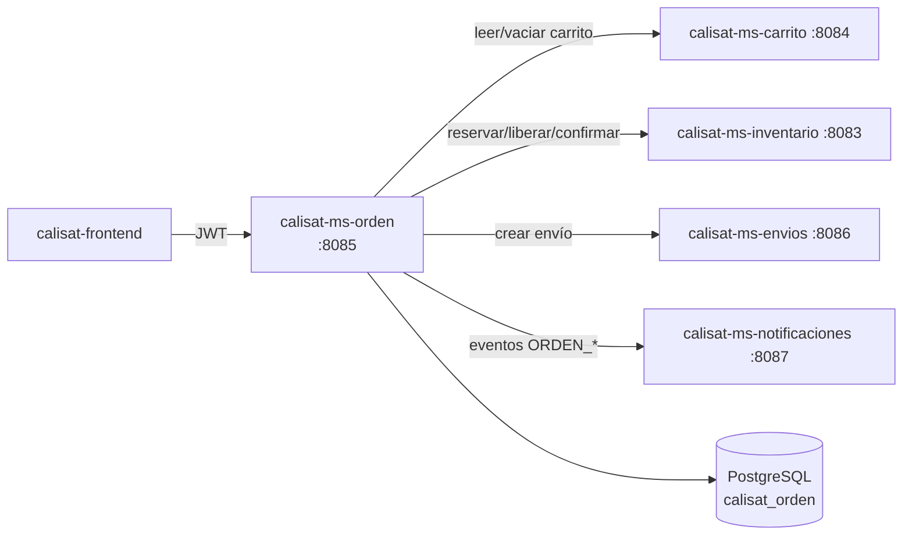

# calisat-ms-orden

> Microservicio Spring Boot de órdenes de compra: creación idempotente, máquina de estados y saga minimal con inventario, carrito, envíos y notificaciones.


**Versión actual: `2.0.0`** (definida en `pom.xml` · historial en [`CHANGELOG.md`](CHANGELOG.md))

---

## 📑 Índice

- [📋 Descripción general](#-descripción-general)
- [✨ Características principales](#-características-principales)
- [🏗️ Arquitectura](#-arquitectura)
- [🚀 Requisitos](#-requisitos)
- [⚙️ Configuración](#-configuración)
- [▶️ Ejecución local](#-ejecución-local)
- [📡 Endpoints principales](#-endpoints-principales)
- [🗃️ Modelo de datos](#-modelo-de-datos)
- [🔒 Seguridad](#-seguridad)
- [🧪 Tests](#-tests)
- [📦 Despliegue](#-despliegue)
- [🔗 Microservicios relacionados](#-microservicios-relacionados)
- [📄 Licencia y modo académico](#-licencia-y-modo-académico)

---

## 📋 Descripción general

**calisat-ms-orden** gestiona las **órdenes de compra** de la plataforma Calisat. Cada orden pertenece al usuario autenticado (`sub` del JWT), congela los **precios de los items** (*snapshot*) y la **dirección de envío** en el momento de su creación.

Desde la **v2.0.0** (fase B), la creación ejecuta un **saga minimal con compensación**: reserva stock → vacía el carrito → publica evento `ORDEN_CONFIRMADA`; al pagar confirma stock y, en la preparación/despacho, crea el envío. Todos los llamados a otros microservicios son **best-effort**: una caída externa nunca interrumpe el flujo principal de la orden.

Incluye **OpenAPI 3 + Swagger UI** y una **máquina de estados** estricta (`409` en transiciones ilegales).

## ✨ Características principales

- 🧾 **Creación idempotente**: cabecera `Idempotency-Key` (prioridad) o clave en el body; si ya existe devuelve la orden previa con `200` (si no, `201` + `Location`).
- 🔐 **Aislamiento por usuario**: cada consulta se scopea con el `sub` del JWT (`404` si la orden es de otro usuario; sin RBAC).
- 🔁 **Máquina de estados**: `PENDIENTE → PAGADA → EN_PREPARACION → ENVIADA → ENTREGADA`, con `CANCELADA` y `FALLO_PAGO`; transiciones ilegales → `409`.
- ⚖️ **Saga minimal con compensación**: reservar al crear → confirmar al pagar (PAGADA) → liberar al cancelar (inventario).
- 🛒 **Integración con carrito**: vaciado best-effort tras confirmar el checkout.
- 📦 **Creación de envío** con snapshot de dirección al pasar a `EN_PREPARACION`/`ENVIADA`.
- 🔔 **Eventos de notificación** `ORDEN_CONFIRMADA` / `ORDEN_CANCELADA` con cabecera `Idempotency-Key`.
- 💲 **Snapshot de precios**: `precio_unitario` y `subtotal` congelados en `OrdenItem`.
- 📕 **OpenAPI 3 + Swagger UI** · 🩺 **Actuator** · 🐳 **Docker multi-stage**.
- 🧪 **25 tests** (servicio + 4 clientes HTTP mockeados).

## 🏗️ Arquitectura



### Estructura de paquetes

```
com.califorge.msorden
├── client/        # CarritoClient, InventarioClient, EnviosClient, NotificacionesClient
├── config/        # SecurityConfig, RestTemplateConfig, CORS
├── controller/    # OrdenController
├── dto/           # OrdenCreateRequest, OrdenResponse, OrdenEstadoRequest, ...
├── exception/     # GlobalExceptionHandler, TransicionNoPermitidaException, ...
├── model/         # Orden, OrdenItem, OrdenEvento, EstadoOrden (JPA)
├── repository/    # OrdenRepository, OrdenItemRepository, OrdenEventoRepository
└── service/       # OrdenService (@Transactional, máquina de estados)
```

## 🚀 Requisitos

| Requisito | Versión mínima |
|-----------|----------------|
| JDK | **21+** (enforcer) |
| Maven | 3.6.3+ (o wrapper `./mvnw`) |
| Docker + Docker Compose | 24+ |
| Servicios del ecosistema | carrito (:8084), inventario (:8083), envios (:8086), notificaciones (:8087) — *opcionales por degradación elegiente* |

## ⚙️ Configuración

Valores de `src/main/resources/application.yaml`, `docker-compose.yml` y variables de cliente:

| Parámetro | Valor |
|-----------|-------|
| **Puerto del servicio** | **`8085`** (`application.yaml` y mapeo Compose `8085:8080`) |
| Base de datos | PostgreSQL · `calisat_orden` |
| Host de BD (local) | `localhost:5435` (Compose publica `5435:5432`) |
| Usuario / contraseña BD | `postgres` / `postgres` *(solo académico)* |
| `ddl-auto` | `update` |
| JWT *issuer* | `https://login.microsoftonline.com/e5372bf0-c5e3-4286-887c-79069f209c1f/v2.0` |
| JWT *audience* | `d221f0d2-1a7c-4872-ad6c-367a1f0717ec` |
| Rutas públicas | `/actuator/health` (GET), `/swagger-ui/**`, `/v3/api-docs/**` |

### Variables de integración (clientes)

| Variable | Defecto | Servicio consumido |
|----------|---------|--------------------|
| `CALISAT_CARRITO_URL` | `http://localhost:8084` | `calisat-ms-carrito` |
| `CALISAT_INVENTARIO_URL` | `http://localhost:8083` | `calisat-ms-inventario` |
| `CALISAT_ENVIOS_URL` | `http://localhost:8086` | `calisat-ms-envios` |
| `CALISAT_NOTIFICACIONES_URL` | `http://localhost:8087` | `calisat-ms-notificaciones` |

> ⚠️ **Modo académico**: issuer, audience y credenciales están **hardcodeados**; en producción deben externalizarse. Sin service discovery: URLs por variables de entorno.

## ▶️ Ejecución local

### 1. Base de datos

```bash
docker compose up -d postgres-db
```

Levanta PostgreSQL 15 publicado en `localhost:5435`.

### 2. Aplicación

```bash
# Windows
mvnw.cmd spring-boot:run

# Linux / macOS
./mvnw spring-boot:run
```

### 3. Docker Compose

```bash
docker compose up --build
```

Servicio en `http://localhost:8085` (Swagger: `/swagger-ui.html`).

## 📡 Endpoints principales

Base: `http://localhost:8085/api/v1/ordenes`

| Método | Ruta | Descripción | Auth |
|--------|------|-------------|------|
| `POST` | `/api/v1/ordenes` | Crear orden (`201` + `Location`; `200` si se reutiliza por idempotencia) | JWT |
| `GET` | `/api/v1/ordenes` | Listar **mis** órdenes (paginado, más reciente primero) | JWT |
| `GET` | `/api/v1/ordenes/{id}` | Detalle de orden propia (404 si no existe o es de otro usuario) | JWT |
| `PUT` | `/api/v1/ordenes/{id}/estado` | Cambiar estado (máquina de estados; 404 · 409 · 400) | JWT |
| `POST` | `/api/v1/ordenes/{id}/cancelar` | Cancelar orden si no está en estado final (404 · 409) | JWT |

**Total: 5 endpoints** · *Swagger UI*: `/swagger-ui.html`

### Máquina de estados

```
PENDIENTE ──► PAGADA ──► EN_PREPARACION ──► ENVIADA ──► ENTREGADA
    │            │
    ├──► CANCELADA / FALLO_PAGO
             │
             └──► EN_PREPARACION (también CANCELADA desde PAGADA)
```

- **Estados finales**: `ENTREGADA`, `CANCELADA`, `FALLO_PAGO` (cancelar en final → `409`).
- Transición no permitida → `409` · estado desconocido → `400` · no encontrado / ajena → `404`.

### Ejemplo

```bash
# Crear orden con idempotencia por cabecera
curl -X POST http://localhost:8085/api/v1/ordenes \
  -H "Authorization: Bearer $TOKEN" \
  -H "Content-Type: application/json" \
  -H "Idempotency-Key: orden-2026-001" \
  -d '{
        "items": [{"sku":"BARRAS-001","nombreProducto":"Barra de dominadas","cantidad":1,"precioUnitario":89.90}],
        "direccionCalle":"Av. Siempreviva 742",
        "direccionCiudad":"Springfield",
        "direccionPais":"US",
        "direccionCodigoPostal":"97402"
      }'
```

## 🗃️ Modelo de datos

### Entidad `Orden` (tabla `orden`)

| Campo | Tipo | Restricciones |
|-------|------|---------------|
| `id` | `UUID` | PK |
| `usuario_sub` | `String(100)` | `NOT NULL` · índice `idx_orden_usuario_sub` |
| `estado` | `Enum` | `PENDIENTE` (default) · ver máquina de estados |
| `subtotal` / `total` | `BigDecimal(12,2)` | Totales congelados |
| `idempotency_key` | `String(100)` | **Único**, nullable |
| `direccion_calle/ciudad/pais/codigo_postal` | `String` | Snapshot de dirección |
| `fecha_creacion` / `fecha_actualizacion` | `LocalDateTime` | `@PrePersist` / `@PreUpdate` |
| `fecha_confirmacion` | `LocalDateTime` | Al confirmar pago |

### Entidad `OrdenItem` (tabla `orden_item`)

| Campo | Tipo | Restricciones |
|-------|------|---------------|
| `id` | `UUID` | PK |
| `orden_id` | FK → `orden` | `NOT NULL` |
| `sku` | `String(64)` | `NOT NULL` |
| `nombre_producto` | `String(200)` | Snapshot del nombre |
| `cantidad` | `int` | `≥ 1` |
| `precio_unitario` | `BigDecimal(12,2)` | `NOT NULL` — precio congelado |
| `subtotal` | `BigDecimal(12,2)` | `NOT NULL` |

### `OrdenEvento` · `EstadoOrden`

- `OrdenEvento`: historial de cambios de estado de la orden.
- `EstadoOrden`: `PENDIENTE`, `PAGADA`, `EN_PREPARACION`, `ENVIADA`, `ENTREGADA`, `CANCELADA`, `FALLO_PAGO`.

## 🔒 Seguridad

- **JWT (OAuth2 Resource Server)** de **Microsoft Entra ID**: validación de *issuer* + *audience*.
- **Sin RBAC**: un único nivel autenticado; cada operación se scopea con `jwt.getSubject()` — el usuario solo accede a **sus** órdenes (*modo académico, usuario genérico*).
- **Rutas públicas**: `GET /actuator/health` y Swagger UI; el resto exige token.
- **CSRF deshabilitado** · **CORS** restringido al origen del despliegue.

## 🧪 Tests

```bash
./mvnw test
```

| Suite | Archivos | Tests |
|-------|----------|-------|
| Unitarios | `OrdenServiceTest` (14), `CarritoClientTest` (3), `InventarioClientTest` (3), `NotificacionesClientTest` (3), `EnviosClientTest` (2) | **25** |

Los tests verifican las llamadas de integración con `RestTemplate` mockeado (sin red).

## 📦 Despliegue

### Docker

```bash
docker build -t calisat-ms-orden:2.0.0 .
docker run -p 8085:8080 --name calisat-ms-orden calisat-ms-orden:2.0.0
```

**Dockerfile multi-stage:**

1. `maven` (Temurin 21) → `mvn clean package`.
2. `eclipse-temurin:21-jre-alpine` → JAR con usuario no root, `MaxRAMPercentage=75`, `HEALTHCHECK` en `/actuator/health`.

### Docker Compose

```bash
docker compose up --build
```

Levanta PostgreSQL 15 (`calisat_orden`, puerto host `5435`) + app en **8085**, red `calisat-net`.

## 🔗 Microservicios relacionados

| Repositorio | Relación |
|-------------|----------|
| [calisat-ms-carrito](https://github.com/DavNat13/calisat-ms-carrito) | **Dependencia**: lee y vacía el carrito al checkout (`CALISAT_CARRITO_URL`, `:8084`) |
| [calisat-ms-inventario](https://github.com/DavNat13/calisat-ms-inventario) | **Dependencia**: reservar/liberar/confirmar stock en el saga (`CALISAT_INVENTARIO_URL`, `:8083`) |
| [calisat-ms-envios](https://github.com/DavNat13/calisat-ms-envios) | **Dependencia**: crea envío al preparar/despachar (`CALISAT_ENVIOS_URL`, `:8086`) |
| [calisat-ms-notificaciones](https://github.com/DavNat13/calisat-ms-notificaciones) | **Dependencia**: eventos `ORDEN_CONFIRMADA`/`ORDEN_CANCELADA` (`CALISAT_NOTIFICACIONES_URL`, `:8087`) |
| [calisat-ms-catalogo](https://github.com/DavNat13/calisat-ms-catalogo) | Catálogo de productos (puerto 8082) |
| [calisat-ms-usuarios](https://github.com/DavNat13/calisat-ms-usuarios) | Perfil y direcciones (puerto 8081) |
| [calisat-frontend](https://github.com/DavNat13/calisat-frontend) | SPA React 19 (v1.4.0) — ruta `/checkout` |

## 📄 Licencia y modo académico

Proyecto desarrollado en **modo académico**; sin licencia open source formal. Issuer, audience y credenciales están *hardcodeados* con fines educativos; sin RBAC (usuario genérico autenticado) y sin service discovery (URLs por variables de entorno).

- **Versión actual**: `2.0.0` — *breaking change*: `OrdenService` ahora inyecta los 4 clientes HTTP (`CarritoClient`, `InventarioClient`, `EnviosClient`, `NotificacionesClient`)
- **Historial de cambios**: [`CHANGELOG.md`](CHANGELOG.md)
